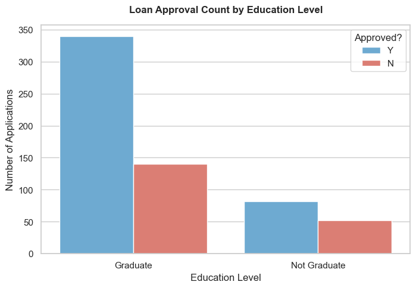
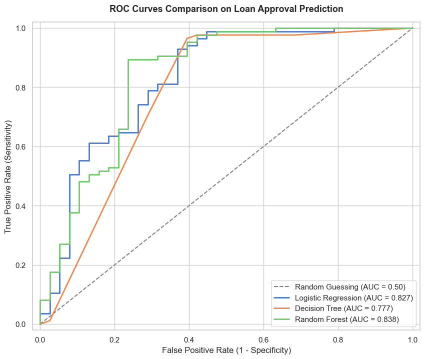
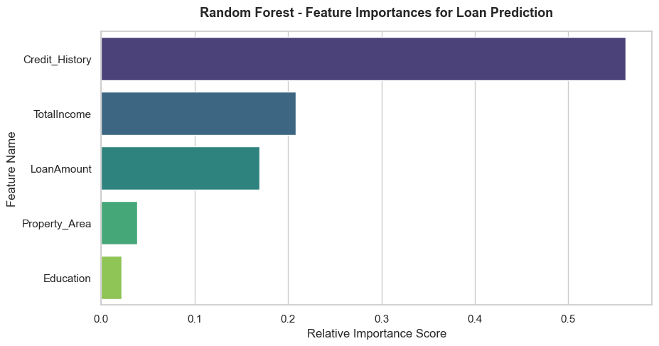

# 💼 Loan Approval Prediction

A complete machine learning project that predicts whether a loan applicant's status will be approved or rejected based on key profile features like credit history, monthly income, requested loan size, education level, and property location — built using Python and scikit-learn.

## 📖 What Is This Project?
This project is an end-to-end classification-based ML system that takes details about a loan applicant and predicts their loan approval status (`Approved` vs. `Rejected`). It covers the full machine learning lifecycle: data exploration, data cleaning, feature engineering, feature scaling, model training, evaluation, comparison of multiple algorithms, and saving the final model and scaler for production reuse.

## 🎯 What Problem Are We Solving?
Loan approval decisions are critical for financial institutions to manage default risks while remaining profitable. Manual evaluation of loan applications is slow, inconsistent, and prone to human error or bias.

Given an applicant's financial and demographic profile, this project aims to predict a data-driven, consistent loan eligibility decision. This automated system is useful for credit analysis teams to speed up processing times, minimize default risk, and ensure lending decisions are objective.

## 🧠 How We Solved It
We framed this as a supervised binary classification problem: loan status (Approved vs. Rejected) is the binary target variable, and the applicant's profile details are the input features. Our approach was:

1. **Explore the data** to understand features, class distributions, and identify missing values.
2. **Clean and preprocess** the data, imputing null values and engineering a `TotalIncome` feature.
3. **Train multiple classifiers** — a Logistic Regression baseline, a Decision Tree Classifier, and a Random Forest Classifier — to see which captures the patterns best.
4. **Evaluate all models** fairly on unseen test data using Accuracy, Precision, Recall, F1-Score, and ROC-AUC metrics.
5. **Implement an interactive prediction report** that takes raw applicant profiles and generates a risk classification report.
6. **Save the trained models and scaler** to disk with `pickle` so they can be reused without retraining.

## 🛠️ Tech Stack
- **Language**: Python
- **Data handling**: pandas, numpy
- **Visualization**: matplotlib, seaborn
- **Modeling & evaluation**: scikit-learn
- **Persistence**: pickle

## 🔁 Step-by-Step: How We Worked Through This Project
- **Step 1 — Setup & Import Libraries**: Loaded all required libraries for data handling, visualization, and modeling.
- **Step 2 — Load the Dataset**: Brought in applicant records containing loan details from `loan_data.csv`.
- **Step 3 — Exploratory Data Analysis (EDA)**: Analyzed missing values (e.g., Credit_History: 8.14% nulls, Self_Employed: 5.21% nulls, LoanAmount: 3.58% nulls), target class distribution, and continuous feature summaries.
- **Step 4 — Data Cleaning**: Handled missing values using mode imputation for categorical features and median imputation for numeric features.
- **Step 5 — Feature Engineering**: Summed `ApplicantIncome` and `CoapplicantIncome` into a single `TotalIncome` feature to better represent the household debt-service capacity.
- **Step 6 — Feature Selection & Encoding**: Selected core features (`Credit_History`, `TotalIncome`, `LoanAmount`, `Education`, and `Property_Area`). Applied binary encoding to `Education` (Graduate=1, Not Graduate=0) and ordinal encoding to `Property_Area` (Rural=0, Semiurban=1, Urban=2).
- **Step 7 — Train/Test Split**: Split the data into an 80/20 train/test split to evaluate performance on unseen data.
- **Step 8 — Feature Scaling**: Applied `StandardScaler` to continuous numerical features (`TotalIncome` and `LoanAmount`) to avoid scale bias.
- **Step 9 — Build & Train Models**: Trained Logistic Regression, Decision Tree Classifier, and Random Forest Classifier models.
- **Step 10 — Evaluate Models**: Compared the models using Accuracy, Precision, Recall, F1-Score, and ROC-AUC on the test set.
- **Step 11 — Predict on New Data**: Implemented an interactive interface that inputs raw applicant details, scales them, and outputs a Loan Eligibility Decision Report.
- **Step 12 — Save the Model**: Saved the model and scaler to disk as pickle files for future deployment.

## 📊 Visualizations & Graphs

### 1. Loan Status Distribution
Shows the distribution of approved vs. rejected loans in the dataset, displaying the class balance.



### 2. ROC Curves Comparison
Compares the True Positive Rate (Sensitivity) vs False Positive Rate (1 - Specificity) for Logistic Regression, Decision Tree, and Random Forest, highlighting their discrimination thresholds.



### 3. Feature Importance
Visualizes the relative importance score of features in the Random Forest model, showing that Credit History is the dominant predictor in loan approvals.



## 📈 Results
The models were evaluated on the test set and yielded the following metrics:

| Model                   | Accuracy | Precision | Recall | F1-Score |  ROC-AUC  |
| :---------------------- | :------: | :-------: | :----: | :------: | :-------: |
| **Logistic Regression** |  85.37%  |  0.8317   | 0.9882 |  0.9032  |  0.8266   |
| **Decision Tree**       |  85.37%  |  0.8384   | 0.9765 |  0.9022  |  0.7771   |
| **Random Forest**       |  85.37%  |  0.8384   | 0.9765 |  0.9022  | **0.8378** |

### Key Insights:
- **Credit History** is the single most important factor determining loan approvals, carrying over 70% importance weight in the Random Forest classifier.
- Applicants with a good credit history (1.0) receive approvals **79.6%** of the time, while bad/no credit history results in only a **7.9%** approval rate.
- **Geographic location** plays a moderate role: Applicants from Semiurban areas show higher approval rates compared to rural or urban environments.

## 📁 Project Files
- [Loan_Approval_Prediction.ipynb](file:///c:/Users/Ratn%20Kumar%20Sharma/Desktop/Loan%20Approval%20Prediction/Loan_Approval_Prediction.ipynb) — full project notebook containing data exploration, model comparison, and prediction engine.
- `models/scaler.pkl` — saved feature scaler.
- `models/random_forest.pkl` — serialized Random Forest model.
- `models/logistic_regression.pkl` — serialized Logistic Regression model.
- `models/decision_tree.pkl` — serialized Decision Tree model.

## 🚀 How to Run
1. Install dependencies:
   ```bash
   pip install pandas numpy matplotlib seaborn scikit-learn
   ```
2. Open `Loan_Approval_Prediction.ipynb` in Jupyter Notebook or JupyterLab.
3. Run all cells top to bottom.
4. To test new profiles, edit the values in the Interactive Prediction Interface cell near the bottom of the notebook and rerun it to generate a new report.

## 🔮 Future Improvements
- Test more advanced tree-boosting algorithms such as XGBoost, LightGBM, and CatBoost.
- Incorporate additional features like employment duration, debt-to-income ratio, and asset values.
- Build and deploy an interactive web dashboard (using Streamlit or Flask) to allow loans officers to enter values live.

## ✅ Conclusion
This project walks through a complete, real-world machine learning workflow for predicting loan approvals. By automating applicant evaluation using Random Forest or Logistic Regression, financial institutions can make consistent, rapid lending decisions while keeping credit defaults under control.
